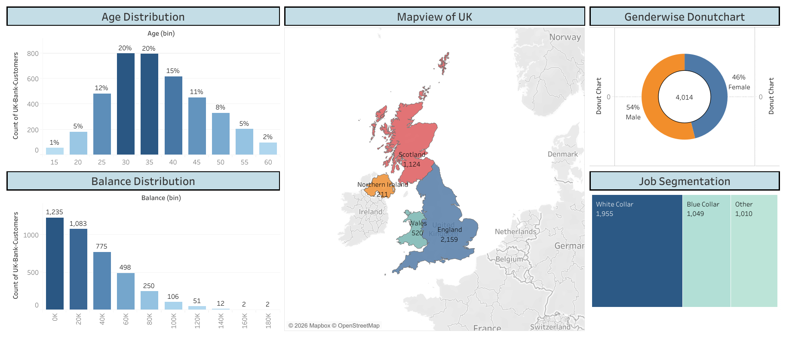

# 🏦 UK Bank Customer Analysis

<div align="center">


**An interactive Tableau dashboard analyzing UK bank customer demographics, regional distribution, account balances, and job classifications.**

[](https://public.tableau.com/views/DonutChartofUkBusinessBank/Dashboard)

</div>

---

## 📌 Project Overview

This project presents a comprehensive visual analysis of **4,014 UK bank customers** using Tableau. The dashboard provides actionable insights into customer segmentation across regions, job types, gender, age groups, and account balances — helping stakeholders understand the bank's customer base at a glance.

---

## 📊 Dashboard Preview



---

## ❓ Business Questions Answered

| # | Question |
|---|----------|
| 1 | 📍 **Which UK regions** have the highest concentration of bank customers? |
| 2 | 👩‍💼 **What is the gender distribution** of customers across England, Scotland, Wales, and Northern Ireland? |
| 3 | 💼 **Which job classification** (White Collar, Blue Collar, Other) dominates the customer base? |
| 4 | 💰 **How is account balance distributed** across different customer segments? |
| 5 | 🎂 **What age groups** make up the majority of the bank's clientele? |
| 6 | 📅 **How did customer acquisition trend** throughout the year 2015? |
| 7 | 🏆 **Who are the top customers** by account balance? |

---

## 🗂️ Repository Structure

```
UK_Bank_Customer_Analysis/
│
├── 📊 Donut Chart of Uk Business Bank.twbx   # Tableau packaged workbook
├── 📋 UK-Bank-Customers.xlsx                  # Source dataset
├── 🖼️  Dashboard.png                           # Dashboard screenshot
└── 📄 README.md                               # Project documentation
```

---

## 📁 Dataset

| Attribute | Details |
|-----------|---------|
| **Source** | [Kaggle – UK Bank Customers](https://www.kaggle.com/datasets/ukveteran/uk-bank-customers) |
| **Rows** | 4,014 customer records |
| **Format** | `.xlsx` (Excel) |

### 🔑 Key Fields

| Column | Description |
|--------|-------------|
| `Customer ID` | Unique identifier for each customer |
| `Name / Surname` | Customer's full name |
| `Gender` | Male / Female |
| `Age` | Customer age |
| `Region` | England, Scotland, Wales, Northern Ireland |
| `Job Classification` | White Collar, Blue Collar, Other |
| `Date Joined` | Enrollment date (Jan–Dec 2015) |
| `Balance` | Account balance (GBP £) |

---

## 📈 Key Insights

- 🏴󠁧󠁢󠁥󠁮󠁧󠁿 **England** accounts for the largest share of the customer base among all four UK regions.
- 👨 **54% Male** vs **46% Female** — a near-balanced gender split across all regions.
- 💼 **White Collar** workers make up the majority job classification, followed by Blue Collar and Other.
- 🎂 Customers aged **30–40** represent approximately **50%** of the total customer base.
- 💷 Account balances show significant variance, with a segment of high-value customers holding substantial funds.

---

## 🛠️ Tools & Technologies

| Tool | Purpose |
|------|---------|
| **Tableau Desktop** | Dashboard creation & data visualization |
| **Tableau Public** | Publishing & sharing the interactive dashboard |
| **Microsoft Excel** | Data source (`.xlsx`) |
| **Kaggle** | Dataset procurement |

---

## 🚀 Getting Started

### Option 1 — View Online (No Installation Required)
👉 Click the badge below to explore the live interactive dashboard:

[](https://public.tableau.com/views/DonutChartofUkBusinessBank/Dashboard)

### Option 2 — Open Locally in Tableau Desktop
1. Clone this repository:
   ```bash
   git clone https://github.com/burney10/UK_Bank_Customer_Analysis.git
   ```
2. Open **Tableau Desktop** (v2020.1 or later recommended).
3. Open the file `Donut Chart of Uk Business Bank.twbx`.
4. Explore and interact with the dashboard using the built-in filters.

---

## 📬 Contact

**Ankan Senapati**
- 🔗 [Tableau Public Profile](https://public.tableau.com/app/profile/ankan.senapati)
- 🐙 [GitHub](https://github.com/burney10)

---

<div align="center">

⭐ **If you found this project useful, please consider giving it a star!** ⭐

*Made with ❤️ using Tableau*

</div>
